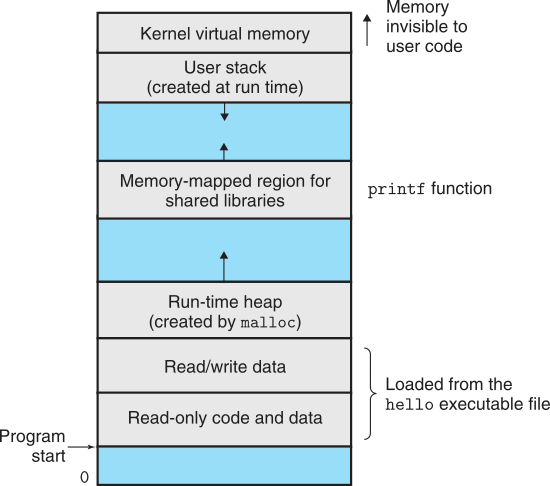

+++
title = "CPython Internals: Memory Allocation"
description = "Algorithm of CPython's default allocator, intended for small Python objects with short lifecycle."
+++

CPython has several memory allocators, intended to used for different domains. `pymalloc` is the main allocator that
operates differently from well-known `malloc` and `free`.

<!-- more -->
*All codes in this post are based on [CPython v3.10](https://github.com/python/cpython/tree/v3.10.0).*

## Review: Memory Layout of Linux Process



Each process has the same uniform view of memory, which is known as its *virtual address space*. The virtual address
space seen by each process consists of a number of areas, each with a specific purpose. When programs require more
memories, they request an additional memory area, usually located between the user stack and the program data.

Linux provides two system calls for this purpose:

- `sbrk` changes the *break pointer*, so the program can use the so-called *heap* area (the area between the break
  pointer and the program data).
- `mmap` explicitly request a new memory area.

Most C Programs use the `malloc` and `free` to dynamically manage the additional memory, which internally uses `sbrk`.
However, CPython uses a different approach called `pymalloc`.

## Allocator Domains of CPython

All allocating functions of CPython belong to one of three different *domains* (see `Include/cpython/pymem.h`:L23-L32
for details)

- Object domain:
  intended for Python objects.
- "Mem" domain:
  intended for Python buffers and general-purpose memory buffers where the allocation must be performed with the GIL
  held.
- Raw domain:
  intended for general-purpose memory buffers where the allocation must go to the system allocator or where the
  allocator can operate without the GIL.

These domains represent different allocation strategies and are optimized for different purposes. Internally, CPython
uses two functions to take a memory; system's `malloc` and Python's `pymalloc`.

| Configuration         | Raw domain        | "Mem" domain       | Object domain      |
|-----------------------|-------------------|--------------------|--------------------|
| Release               | `malloc`          | `pymalloc`         | `pymalloc`         |
| Debug                 | `malloc` + debug  | `pymalloc` + debug | `pymalloc` + debug |
| Release, w/o pymalloc | `malloc`          | `malloc`           | `malloc`           |
| Debug, w/o pymalloc   | `malloc` + debug  | `malloc` + debug   | `malloc` + debug   |

`pymalloc` is optimized for small objects (smaller or equal to 512 bytes) with a short lifetime. It falls back to
`malloc` for allocations larger than 512 bytes.

## Memory allocation algorithm of `pymalloc`

`pyalloc` first takes a large memory chunk from system, and internally manages all objects and data structures inside
the chunk. The memory chunk is called an *arena*, and each arena consists of *pools* and *blocks*.

### Arena


Arenas are the largest chunks of memory and are aligned on a page boundary in memory, where CPython assumes the
system's page size is 256kB. Note that arenas are the only things that can truly be freed.

Arenas can be organized into a (doubly) linked list. In fact, CPython manages three lists of arenas:

- `arenas` (`Objects/obmalloc.c`:L1212):
  list of all arenas.
- `unused_arena_object` (`Objects/obmalloc.c`:L1219):
  list of every empty arenas.
- `usable_arenas` (`Objects/obmalloc.c`:L1224):
  arenas with pools available, maintained in increasing order of `nfreepools` (see next section for details).

```c
struct arena_object {
    uintptr_t address;
    struct arena_object* nextarena;
    struct arena_object* prevarena;
    uint nfreepools;
    /* ... */
};
```

New arenas can be allocated via `new_arena()` (`Objects/obmalloc.c`:L1533). When the `new_arena()` is initially called,
it allocates 16 arenas, and doubles the number of arenas for each subsequent calls.

The arena allocator internally uses the following functions:

- `VirtualAlloc()`/`VirtualFree()` on Windows,
- `mmap()`/`munmap()` if available,
- `malloc()`/`free()` otherwise.

### Pools


An arena is composed of 64 pools (*i.e.*, size of each pool is 4kB), where each pool can only store blocks with
predefined sizes. For instance, if the size class index of a pool is 3, it can store only 25-32 byte of blocks. Each
pool maintains a double-linked list to other pools of the same size class.

```c
struct arena_object {
    /* ... */
    uint ntotalpools;
    struct pool_header* freepools;
    block* pool_address;
};

struct pool_header {
    struct pool_header *nextpool;       /* next pool of this size class  */
    struct pool_header *prevpool;       /* previous pool       ""        */
    uint arenaindex;                    /* index into arenas of base adr */
    uint szidx;                         /* block size class index        */
    /* ... */
};
typedef struct pool_header *poolp;
```

Pools themselves must be in one of three states:

- Used:
  Some block is used and available blocks exist.
- Full:
  Every block is used so no available block exists.
- Empty:
  No data is stored, so any size class can be assigned.

To track the pool, CPython manages `usedpools` and `freepools` variables. When a given block size is requested, CPython
checks available pools in `usedpools`. If no pool is found, initialize an empty pool in `freepools` with the size class
and add to `usedpools` for its size class.

### Blocks


Structure of blocks is simple; it's just a memory address.

```c
struct pool_header {
    /* ... */
    union { block *_padding;
            uint count; } ref;          /* number of allocated blocks    */
    block *freeblock;                   /* pool's free list head         */
    uint nextoffset;                    /* bytes to virgin block         */
    uint maxnextoffset;                 /* largest valid nextoffset      */
};

typedef uint8_t block;
```

Similar to the pool, blocks can have one of the three states:

- Untouched:
  Blocks have not been allocated.
- Free:
  Blocks had allocated but *freed* later by CPython.
- Allocated:
  Blocks allocated.

Note that each pool has a pointer `freeblock`. As CPython makes a block *free*, the block is filled with previous
`freeblock` value while `freeblock` is filled with the address of this newly free block. In other words, `freeblock`
points to a singly linked list of free blocks of the pool.

```c
static inline void* pymalloc_alloc(void *ctx, size_t nbytes) {
    if (UNLIKELY(nbytes == 0)) return NULL;
    if (UNLIKELY(nbytes > SMALL_REQUEST_THRESHOLD)) return NULL;

    uint size = (uint)(nbytes - 1) >> ALIGNMENT_SHIFT;
    poolp pool = usedpools[size + size];
    block *bp;

    if (LIKELY(pool != pool->nextpool)) {
        // used pool exists for this size class
        bp = pool->freeblock;
        assert(bp != NULL);
        if (UNLIKELY((pool->freeblock = *(block **)bp) == NULL)) {
            // exausted freeblock
            pymalloc_pool_extend(pool, size);
        }
    } else {  // no used pool exists; allocate new one from freepools
        bp = allocate_from_new_pool(size);
    }
    return (void *)bp;
}

static void pymalloc_pool_extend(poolp pool, uint size) {
    if (UNLIKELY(pool->nextoffset <= pool->maxnextoffset)) {
        // untouched exists
        pool->freeblock = (block*)pool + pool->nextoffset;
        pool->nextoffset += INDEX2SIZE(size);
        *(block **)(pool->freeblock) = NULL;
    } else {  // full pool; unlinked to usedpools
        poolp next;
        next = pool->nextpool; pool = pool->prevpool;
        next->prevpool = pool; pool->nextpool = next;
    }
}
```

## Reference

- Randal E. Bryant and David R. O'Hallaron, *Computer Systems: A Programmer's Perspective* (3/E).
- Alexander VanTol, [Memory Management in Python].

[Memory Management in Python]:
https://realpython.com/python-memory-management/
