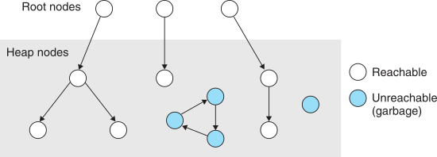
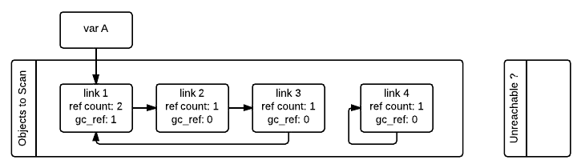
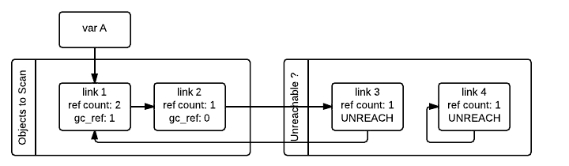
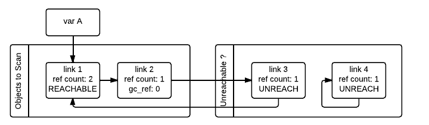
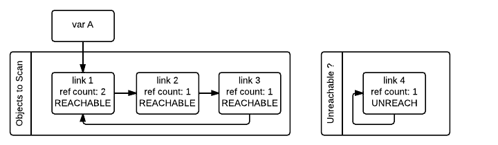

+++
title = "CPython Internals: Garbage Collection Basics"
description = "Reference counting system and reference cycle detection algorithm of CPython's GC module."
+++

CPython manages the memory by using a garbage collector, where the garbage collector relies on the reference counting
with a cycle detection algorithm.

<!-- more -->
*All codes in this post are based on [CPython v3.10](https://github.com/python/cpython/tree/v3.10.0).*

## Review: Basics of Garbage Collection

Manually managing the dynamic memory area is a risky approach becaus of mistakes that are highly prone to occur. For
instance, the program may free the memory that is being used (*dangling pointer*), or may continue to occupy the unused
memory area (*memory leak*). To prevent these errors as possible, modern programming languages have a memory management
system that automatically frees the memory blocks.



A *garbage collector* (GC) is a system that periodically frees the *unreachable* memory. Since the unreachable memories
can never be used anymore, it's safe to free the garbage at any point in time. To effectively free the unreachable
memories, GC internally maintains the auxiliary status of memory reachability.

## Reference Counting

Most basic method is *reference counting*. All CPython objects `PyObject` have a field `ob_refcnt` that stores the
number of references that point to themselves.

```c
typedef struct _object {
    Py_ssize_t ob_refcnt;   // reference count
    PyTypeObject *ob_type;  // pointer to concrete type
} PyObject;

typedef struct _typeobject {
    PyObject *tp_alloc(PyTypeObject *, Py_ssize_t);

    int tp_is_gc(PyObject *);
    int tp_clear(PyObject *);

    void tp_dealloc(PyObject *)
    void tp_finalized(PyObject *)
    void tp_free(void *);  // low-level free-memory routine

    // call visitproc for all referencing objects
    int tp_traverse(PyObject *, visitproc, void *);
    /* ... */
} PyTypeObject;

typedef int (*visitproc)(PyObject *, void *);
```

When the `ob_refcnt` becomes 0, it implies that the object is unreachable and thus CPython immediately deallocates
the occupied memory area. It seems nice, but the problem is that it cannot handle *reference cycles*:

```python
>>> container = []
>>> container.append(container)
>>> sys.getrefcount(container)
3
>>> del container  # never falls to 0 due to its own internal reference
```

One could think that cycles are uncommon, but in reality, there are lots of cycles generated from several causes:

- Data structures like graphs.
- Instances have references to their class.
  The class references its module and the module contains references to *everything* that is inside, so this can lead
  back to the original instance.
- Exceptions.
  They contain traceback that contain a list of frames that contain the exception itself.
- Module-level functions.
  To resolve global variables, they reference the module which contains references to module-level functions.

Therefore, CPython has `gc` module for detecting the reference cycle. The main process is defined in
`Modules/gcmodule.c`:L1180-1357.

## Extra Memory Layout for Reference Cycle Detection

In order to support the reference cycle detection, the memory layout of objects is altered to accommodate extra
information *before* the normal layout. The additional data store in the head are:

- Pointer for previous and next objects.
- Temporal copy of a reference count.
- Bit masks to denote several statuses.
  - `PREV_MASK_COLLECTING`: whether an object has not been visited yet.
  - `NEXT_MASK_UNREACHABLE` whether an object is tentatively unreachable.
  - `_PyGC_PREV_MASK_FINALIZED`: whether an object has been already finalized.

```c
typedef struct {
    uintptr_t _gc_next;
    uintptr_t _gc_prev;
} PyGC_Head;  // CPython reuses these fields to hold all necessary info

#define _PyGC_PREV_SHIFT           (2)
#define _PyGC_PREV_MASK_FINALIZED  (1)
#define PREV_MASK_COLLECTING       (2)
#define NEXT_MASK_UNREACHABLE      (1)
```

To employ the extra information, CPython provides two macros (`AS_GC` and `FROM_GC`) and wrapper for `pymalloc`
(`_PyObject_GC_Alloc`).

```c
#define AS_GC(o) ((PyGC_Head *)(o)-1)
#define FROM_GC(g) ((PyObject *)(((PyGC_Head *)g)+1))

static PyObject * _PyObject_GC_Alloc(int use_calloc, size_t basicsize) {
    /* ... */

    size_t size = sizeof(PyGC_Head) + basicsize;
    PyGC_Head *g = (PyGC_Head *)PyObject_Malloc(size);
    g->_gc_next = 0;
    g->_gc_prev = 0;

    /* ... */

    PyObject *op = FROM_GC(g);
    return op;
}
```

## Identifying Reference Cycles

The code for finding reference cycles is `deduce_unreachable` at `Modules/gcmodule.c`:L1069-1146, which requires two
disjoint doubly-linked lists as parameters:

- `base`: a list contains objects to be scanned.
- `unreachable`: another list contains objects *tentatively* unreachable.

```c
static inline void deduce_unreachable(PyGC_Head *base,
                                      PyGC_Head *unreachable) {
    update_refs(base);                    // gc_prev is used for gc_refs
    subtract_refs(base);
    gc_list_init(unreachable);
    move_unreachable(base, unreachable);  // gc_prev is pointer again
}
```

When the GC starts, it scans all the container objects in `base` and initializes `PyGC_Head` via `gc_reset_refs`. The
initialization step updates GC's `_gc_prev` field (`gc_ref` in the figure) by copying the value of the original
reference count `ob_refcnt` in `PyObject` (`ref count` in the figures).

```c
static void update_refs(PyGC_Head *containers) {
    PyGC_Head *gc = GC_NEXT(containers);
    for (; gc != containers; gc = GC_NEXT(gc))
        gc_reset_refs(gc, Py_REFCNT(FROM_GC(gc)));
}

static inline void gc_reset_refs(PyGC_Head *g, Py_ssize_t refs) {
    g->_gc_prev = (g->_gc_prev & _PyGC_PREV_MASK_FINALIZED)
        | PREV_MASK_COLLECTING                           // set collecting flag
        | ((uintptr_t)(refs) << _PyGC_PREV_SHIFT);       // reset refcount
}
```

Consider the following memory status as an example.


GC then iterates `base` and decrements the reference count of any other object that the container is *directly*
pointing. After all the objects have been scanned, only the objects that have references from outside will have
`gc_refs > 0`.

```c
static void subtract_refs(PyGC_Head *containers) {
    PyGC_Head *gc = GC_NEXT(containers);
    for (; gc != containers; gc = GC_NEXT(gc)) {
        PyObject *op = FROM_GC(gc);
        (Py_TYPE(op)->tp_traverse)(
            FROM_GC(gc),
            (visitproc)visit_decref,
            op);
    }
}

static int visit_decref(PyObject *op, void *parent) {
    PyGC_Head *gc = AS_GC(op);
    if (gc_is_collecting(gc)) gc_decref(gc);
    return 0;
}
```

After applying `subtract_refs`, the memory is in a state as shown in the following figure. Note that, as you can see
below, `gc_refs == 0` *does not* imply that the object is unreachable.



Finally, GC finds all unreachable objects by calling `move_unreachable`. `move_unreachable` re-scans all objects in
`base` and does the following:

- When encounters an object with `gc_refs > 0`, first it marks the object as reachable. Then, it traverses all objects
  that are *directly reachable* from the object and does the following:
  - Increases `gc_refs` if `gc_refs == 0`, so the objects can be marked as reachable later.
  - If some objects are in `unreachable`, move to `base`.
- When encounters an object with `gc_refs == 0`, it moves the object from `base` to `unreachable` and mark as
  unreachable.

Once all the objects are scanned, the GC knows that all container objects in `unreachable` are actually unreachable and
can thus be collected.

```c
// some variable names differ from original codes, to enhance human readability
static void move_unreachable(PyGC_Head *base, PyGC_Head *unreachable) {
    PyGC_Head *prev = base; PyGC_Head *curr = GC_NEXT(base);
    while (curr != base) {
        if (gc_get_refs(curr)) {  // gc_ref > 0
            PyObject *op = FROM_GC(curr);
            (Py_TYPE(op)->tp_traverse)(
                FROM_GC(curr),
                visit_reachable,
                (void *)base);

            _PyGCHead_SET_PREV(curr, prev);  // relink gc_prev to prev element.
            gc_clear_collecting(curr);       // mark as visited
            prev = curr;
        } else {  // gc_ref == 0
            prev->_gc_next = curr->_gc_next;
            // no need to curr->next->prev = prev because it is single linked

            // moves curr from base to unreachable & mark as unreachable.
            PyGC_Head *last = GC_PREV(unreachable);
            last->_gc_next = (NEXT_MASK_UNREACHABLE | (uintptr_t)curr);
            _PyGCHead_SET_PREV(curr, last);
            curr->_gc_next = (NEXT_MASK_UNREACHABLE | (uintptr_t)unreachable);
            unreachable->_gc_prev = (uintptr_t)curr;
        }
        curr = (PyGC_Head*)prev->_gc_next;
    }
    base->_gc_prev = (uintptr_t)prev;
    // don't let the pollution of the list head's next pointer leak
    unreachable->_gc_next &= ~NEXT_MASK_UNREACHABLE;
}

static int visit_reachable(PyObject *op, PyGC_Head *reachable) {
    PyGC_Head *gc = AS_GC(op); const Py_ssize_t gc_refs = gc_get_refs(gc);
    if (! gc_is_collecting(gc)) return 0;  // ignore visited objects

    if (gc->_gc_next & NEXT_MASK_UNREACHABLE) {  // object in unreachable
        /* remove current object from unreachable */
        PyGC_Head *prev = GC_PREV(gc);
        PyGC_Head *next = (PyGC_Head*)(gc->_gc_next & ~NEXT_MASK_UNREACHABLE);
        prev->_gc_next = gc->_gc_next;
        _PyGCHead_SET_PREV(next, prev);

        /* ... and append to base */
        gc_list_append(gc, reachable);

        gc_set_refs(gc, 1);
    } else if (gc_refs == 0) {  // object in base and gc_ref == 0
        gc_set_refs(gc, 1);
    }
    return 0;
}
```

Following image depicts the state of the lists in a moment when the GC processed the `link_3` and `link_4` but has not
processed `link_1` and `link_2` yet.



Then GC scans `link_1` and marks as reachable.



After that, GC scans `link_2` and this moves `link_3` from `unreachable` to `base`. GC finally scans `link_3` and mark
it as reachable and the process is finished.



Note that no recursion is required by any of this process, and neither does it in any other way require additional
memory, except for \\(O(1)\\) storage for internal C needs.

## References

- Randal E. Bryant and David R. O'Hallaron, *Computer Systems: A Programmer's Perspective* (3/E).
- Pablo Galindo Salgado, [Design of CPython's Garbage Collector]

[Design of CPython's Garbage Collector]:
https://devguide.python.org/garbage_collector/
