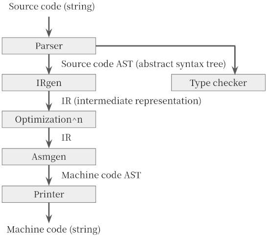
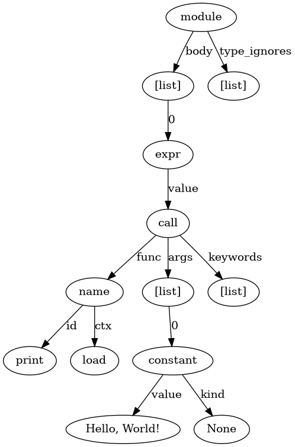
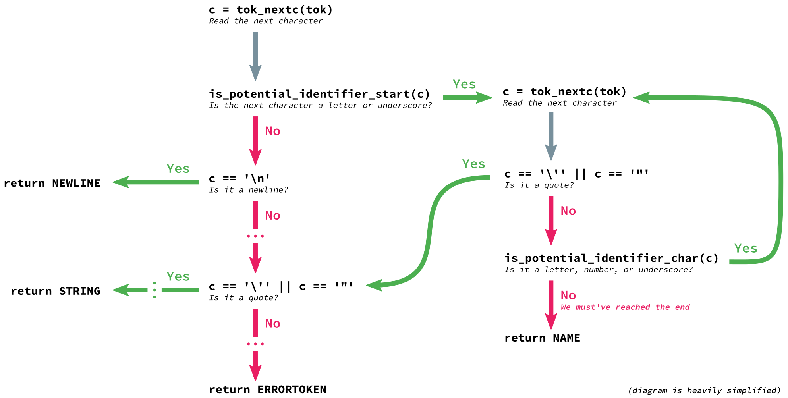

+++
title = "CPython Internals: Frontend of Bytecode Compiler"
description = "How CPython understand the Python syntax and parse the code?"
+++

Typically, compilers consist of two parts: a frontend and a backend. This post will cover the frontend of CPython's
bytecode compiler, or "how CPython understand the human-readable code?"

<!-- more -->
*All codes in this post are based on [CPython v3.10](https://github.com/python/cpython/tree/v3.10.0).*

## Review: Compiler Organization

Typically, compilers consist of following components:



### Frontend: Parser & Type Checker

*Parser* generates the *abstract syntax tree* (AST) from the raw source code. An AST is a tree representation of source
code that reflecting the grammatical aspects into the structure. Each interior node represents an operation while its
children represent the arguments. The AST is used intensively during various static analysis, *e.g.*, type checking.

For instance, the following Python snippet

```python
print('Hello, World!')
```

is converted into the following AST:



### Backend: IR Generator, Optimizers & Code Generator

Instead of directly translating to machine-readable code, many compilers generate an intermediate representation (IR),
which we can think of as a program for an abstract machine. An IR is designed to be conducive for further optimization
steps.

Note that there might exist various levels of intermediate representations, such as [control flow graphs] (CFG) and
[register machines].

Lastly, the IR is translated to the machine-readable code. While most compilers generate machine codes that targeting
the specific *physical* architectures (*e.g.*, x86, ARM, ...), CPython translates the IR into the *bytecode*, which is
executed via CPython virtual machine later.

[control flow graphs]: https://en.wikipedia.org/wiki/Control-flow_graph
[register machines]: https://en.wikipedia.org/wiki/Register_machine

## Specification

The grammar of Python can be found in following files:

- `Grammar/Tokens` contains the token specification.
- `Grammar/python.gram` contains the grammar specification, specified using [parser expression grammar] (PEG), with
  corresponding AST nodes.
  - PEG parser is introduced since CPython v3.9. Before v3.9, CPython used [LL(1) parser]. See
    [below](#comparison-between-ll-1-vs-peg) for details.
- `Parser/Python.asdl` contains the specification of the AST, specified using
  [Zephyr Abstract Syntax Definition Language][Zephyr ASDL].
  - The definition is independent of its realization in *any* particular programming language.

Note that various files, including the source code of the parser, are automatically generated from these definitions.
Thus, whenever you changed the syntactic definition, you should re-generate those files via running following commands:

```bash
# regenerates Include/token.h, Parser/token.c, Lib/token.py
# from Grammar/Tokens
# using Tools/scripts/generate_token.py:
> make regen-token
# regenerates Parser/parser.c
# from Grammar/python.gram and Grammar/Tokens
# using Tools/peg_generator/pegen:
> make regen-pegen
# regenerate Include/Python-ast.h and Python/Python-ast.c
# from Parser/Python.asdl
# using Parser/asdl_c.py:
> make regen-ast
```

### Comparison Between LL(1) vs. PEG

LL(1) is a kind of [context-free grammar] (CFG). CFG is used by lots of programming languages, although it has some
critical limitations. Two problems, ambiguous rules and inability to left-recursive rules, is pointed out in [PEP-617].
Although the problems *might* be avoided by generating equivalent LL(1) rules, it may be harder for programmers to
catch its meaning.

PEG, on the other hand, cannot suffer from the ambiguity. In addition, while general PEG does not support the
left-recursion, CPython's parser allows us to write left-recursive rules. It may include not only the direct
recursions, but also complicated rules with indirect or hidden left-recursions.

More details can be found on [CPython devguide][Guide to CPython's Parser].

[context-free grammar]: https://en.wikipedia.org/wiki/Context-free_grammar
[parser expression grammar]: https://en.wikipedia.org/wiki/Parsing_expression_grammar
[LL(1) parser]: https://en.wikipedia.org/wiki/LL_parser
[PEP-617]: https://www.python.org/dev/peps/pep-0617/
[Zephyr ASDL]: https://dl.acm.org/doi/10.5555/1267950.1267967

## Entrypoints to CPython Tokenizers/Parsers

There are multiple ways to execute CPython binary, stated in `pymain_run_python` function defined in `Modules/main.c`:

- Execute with a command via `-c` argument, *e.g*, `python -c "print(1 + 3)"`
- Execute a module via `-m` argument, *e.g.*, `python -m http.server`
- Execute a script file
- Execute with a command via stdin, *e.g.*, `echo "print(1 + 3)" | python`
- Execute without any arguments to open up the REPL

```c
static void pymain_run_python(int *exitcode) {
    /* ... */
    PyInterpreterState *interp = _PyInterpreterState_GET();
    PyConfig *config = (PyConfig*)_PyInterpreterState_GetConfig(interp);

    /* ... */
    if (config->run_command) {
        *exitcode = pymain_run_command(config->run_command);
    } else if (config->run_module) {
        *exitcode = pymain_run_module(config->run_module, 1);
    } else if (main_importer_path != NULL) {
        *exitcode = pymain_run_module(L"__main__", 0);
    } else if (config->run_filename != NULL) {
        *exitcode = pymain_run_file(config);
    } else {
        *exitcode = pymain_run_stdin(config);
    }
    pymain_repl(config, exitcode);
    /* ... */
}
```

For each method, CPython calls different tokenizers and/or parsers.

- All `pymain_run_file`, `pymain_run_stdin` and `pymain_repl` rely on `_PyRun_AnyFileObject`, which uses
  `_PyParser_ASTFromFile`.
- `_PyParser_ASTFromString` is called when CPython is executed via `pymain_run_command`.
- When executing via `pymain_run_module`, CPython wraps the module using `runpy._run_code`, which loads the code
  objects via built-in `exec`. If the module has not been compiled yet, CPython runs `compile` on the module, which
  calls  `_PyParser_ASTFromString` (see `builtin_compile_impl` in `Python/bltinmodule.c`).

## Source Code to Tokens

First of all, the source code is grouped into meaningful sequences of *tokens*. Each token can have a token name and an
optional attribute value. For instance, the code

```python
print('Hello, World!')
```

can be tokenized into:

```
0,0-0,0:            ENCODING       'utf-8'
1,0-1,5:            NAME           'print'
1,5-1,6:            OP             '('
1,6-1,21:           STRING         "'Hello, World!'"
1,21-1,22:          OP             ')'
1,22-1,23:          NEWLINE        '\n'
2,0-2,0:            ENDMARKER      ''
```

Parser consumes those tokens and builds the AST. If you're interested in how the CPython tokenizer works, see `tok_get`
function defined in `Parser/tokenizer.c`, or see
[the excellent post by Benjamin Woodruff][A Deep Dive into Python's Tokenizer]. This post won't cover the tedious
details :)



## Tokens to Abstract Syntax Tree

Both `_PyParser_ASTFromString` and `_PyParser_ASTFromFile` are thin wrapper of `_PyPegen_run_parser`, which internally
calls `_PyPegen_parse` in `Grammar/python.gram`:

```c
void* _PyPegen_parse(Parser *p) {
    /* ... */
    void *result = NULL;
    if (p->start_rule == Py_file_input) {
        result = file_rule(p);
    } else if (p->start_rule == Py_single_input) {
        result = interactive_rule(p);
    } else if (p->start_rule == Py_eval_input) {
        result = eval_rule(p);
    } else if (p->start_rule == Py_func_type_input) {
        result = func_type_rule(p);
    } else if (p->start_rule == Py_fstring_input) {
        result = fstring_rule(p);
    }
    return result;
}
```

Each rule function generates an AST tree until all non-terminal symbols are replaced and returns its root node.  AST
nodes are C structs generated from their definition. For instance, `file_rule` returns the following struct
representing the mod node

```c
enum _mod_kind {
    Module_kind=1,
    Interactive_kind=2,
    Expression_kind=3,
    FunctionType_kind=4
};
struct _mod {
    enum _mod_kind kind;
    union {
        struct {
            asdl_stmt_seq *body;
            asdl_type_ignore_seq *type_ignores;
        } Module;

        struct {
            asdl_stmt_seq *body;
        } Interactive;

        struct {
            expr_ty body;
        } Expression;

        struct {
            asdl_expr_seq *argtypes;
            expr_ty returns;
        } FunctionType;

    } v;
};
```

which is generated from the following definition:

```asdl
mod = Module(stmt* body, type_ignore* type_ignores)
    | Interactive(stmt* body)
    | Expression(expr body)
    | FunctionType(expr* argtypes, expr returns)
```

Notice that `_PyPegen_run_parser` might call `_PyPegen_parse` twice if the first attempt has failed. This is because
the second parsing can use additional rules thus the error report can be enhanced. Since using these custom rules has
severe degradation, CPython applies these rules only if an error occurs.

```c
void * _PyPegen_run_parser(Parser *p) {
    void *res = _PyPegen_parse(p);
    if (res == NULL) {  // parser has failed
        // some exception has been raised
        if (PyErr_Occurred() && !PyErr_ExceptionMatches(PyExc_SyntaxError))
            return NULL;

        // reset parser and parse again
        Token *last_token = p->tokens[p->fill - 1];
        reset_parser_state(p);
        _PyPegen_parse(p);
        /* ... */

        // notice that the second attempt always failed
        return NULL;
    }

    /* ... */
}
```

The rules for the error reports starts with `invalid_`. For instance, the following rule

```asdl
invalid_kwarg:
    | a=NAME b='=' expression for_if_clauses {
        RAISE_SYNTAX_ERROR_KNOWN_RANGE(a, b,
            "invalid syntax. Maybe you meant '==' or ':=' instead of '='?")}
    | !(NAME '=') a=expression b='=' {
        RAISE_SYNTAX_ERROR_KNOWN_RANGE(
            a, b,
            "expression cannot contain assignment, perhaps you meant \"==\"?")}
```

will be raised in the following situations:

```python
>>> x = 3
>>> if x = 3: x += 1
  File "<stdin>", line 1
    if x = 3: x += 1
       ^^^^^
SyntaxError: invalid syntax. Maybe you meant '==' or ':=' instead of '='?
>>> y = dict(1=2)
  File "<stdin>", line 1
    y = dict(1=2)
             ^^
SyntaxError: expression cannot contain assignment, perhaps you meant "=="?
```

## Reference

- Various resources on compilers
  - Alfred V. Aho and others, *Compilers: Principles, Techniques, and Tools* (2/E).
  - [KAIST CS420: Compiler Design](https://github.com/kaist-cp/cs420)
- Various articles from CPython Devguide
  - [Changing CPython's Grammar]
  - [Guide to CPython's Parser]
  - [Design of CPython's Compiler]
- Benjamin Woodruff, [A Deep Dive into Python's Tokenizer].

[Changing CPython's Grammar]: https://devguide.python.org/grammar/
[Guide to CPython's Parser]: https://devguide.python.org/parser/
[Design of CPython's Compiler]: https://devguide.python.org/compiler
[A Deep Dive into Python's Tokenizer]: https://benjam.info/blog/posts/2019-09-18-python-deep-dive-tokenizer/
