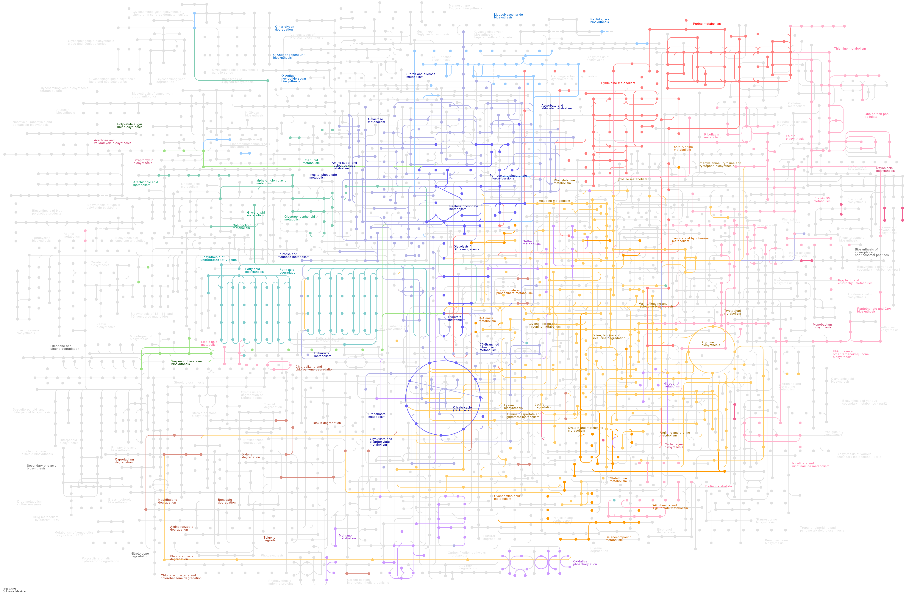
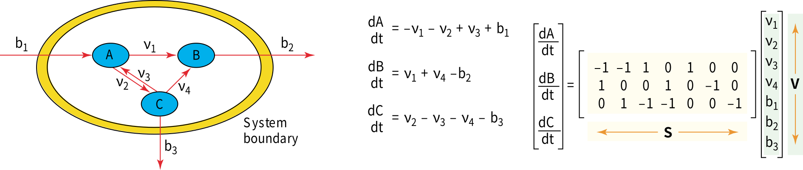

+++
title = 'Flux Balance Analysis'
description = 'Basic concept of flux balance analysis (FBA) and its application on target identification of SARS-CoV-2.'
date = '2021-12-28'
+++

Flux balance analysis (FBA) is a mathematical approach for analyzing the flow of metabolites through a metabolic
network.

<!-- more -->

## Genome-scale Metabolic Network

*Metabolism* is the set of all biochemical reactions inside a cell, where most reactions are catalyzed by enzymes.
Common types of metabolism are:

- conversion of food to energy (ATP),
- conversion of food to proteins, lipids, nucleic acids, ...,
- elimination of wastes.

With the sequencing of complete genomes, it is now possible to reconstruct the network of biochemical reactions in many
organisms (including [*Homo sapiens*][kegg]). From this metabolic network, one can use *simulations* to make
predictions on various interesting properties (*e.g.*, the maximum growth rate of some bacteria in the presence and
absence of oxygen).

## Metabolic Flux via Mass Balance Equations

From the network, one can derive mass balance equations, which can be expressed as a set of ordinary differential
equations.

In this Figure, the model system comprising three metabolites \\(A\\), \\(B\\) and \\(C\\), with three internal fluxes
\\(v_i\\) (including one reversible reaction) and three exchange fluxes \\(b_i\\).

The mass balance is also presented in this figure, which is defined in terms of the flux through each reaction and the
stoichiometry of that reaction. Note that the equations can be represented using a matrix notation; \\(S\\) is the
stoichiometric matrix and \\(v\\) is the vector of the fluxes.

Furthermore, researchers found that the metabolite concentrations equilibrate fast (~seconds) with respect to the
timescale of genetic regulation (~minutes), thus one can safely assume the steady state of mass balance; *i.e.*,
\\(dS/dt=0\\)! Therefore, the mass balance equation is simplyfied into \\(Sv=0\\).

However, notice that the flux balance equation is underdetermined, since the number of reactions is larger than the
number of metabolites. Thus, just solving the equation is not enough; we need more conditions to uniquely determine the
meaningful solution.

## Convert Balance Equations into Optimization Problem

To identify a physiologically meaningful solution, one can add a biological *objective function*. This turns the
problem into the linear programming (while the objective is linear). Common objective functions are:

- maximization of biomass,
- maximization/minimization of ATP,
- maximization of the rate of synthesis of aparticular product.

We can also add *constraints* to the optimization problem, so we can reflect some specific biological circumstances,
*e.g.*,

- physico-chemical; conservation of mass, energy, momentum, ...
- environmental; nutrient availability, temperature, ...
- topobiological; molecules are crowded in cells and this constrains their form and function
- regulatory; the gene products made and their activities may be switched on and off

## Practical Example: Target Identification of SARS-CoV-2

Renz *et al.* (2020) reveal a novel potential target of SARS-CoV-2 as follwed:

1. Generate an integrated host-virus metabolic model by combining

   1. iAB-AMØ-1410; a public model of human alveolar macrohages
   2. virus biomass reactions of SARS-CoV-2, constructed as followed:

      - Using the annotated nucleotide sequence of the virus, they calculate the amount of nucleotides, amino acids and
        energy required by the virus production.
      - Then, they collect *all* metabolisms related to these metabolites to build a custom model.

2. Identifying candidate reactions from the stoichiometric difference between uninfected vs. infected cells
3. Use FBA to investigate the actual metabolic changes.

   - Objective functions:
     - Uninfected: host biomass maintenance
     - Infected: total viral molar mass
   - Knock-out each reactions in both uninfected and infected cells, and find reactions that do not harm the host cell
     but disturb the viral growth.
   - **Guanylate kinase (GK1) reaction is revealed as a promising target**

4. Conduct host-derived enforcement analysis

   - Based on flux variability analysis
   - **More possible targets revealed**

5. Find existing drugs in literatures that directly inhibits GK1

## References

- Kauffman *et al.* (Curr. Opin. Biotechnol. 2003). [Advances in flux balance analysis][fba].
- Renz *et al.* (Bioinformatics 2020).
  [FBA reveals guanylate kinase as a potential target for antiviral therapies against SARS-CoV-2][covid19].
  - Author's talk @ ISMB 2020

    

      <iframe class="has-ratio" width="640" height="360" src="https://www.youtube.com/embed/N6QAl6_u6sM" frameborder="0" allowfullscreen></iframe>
    

[kegg]:
https://www.genome.jp/kegg-bin/show_pathway?hsa01100+M00076
[fba]:
https://doi.org/10.1016/j.copbio.2003.08.001
[covid19]:
https://doi.org/10.1093/bioinformatics/btaa813
